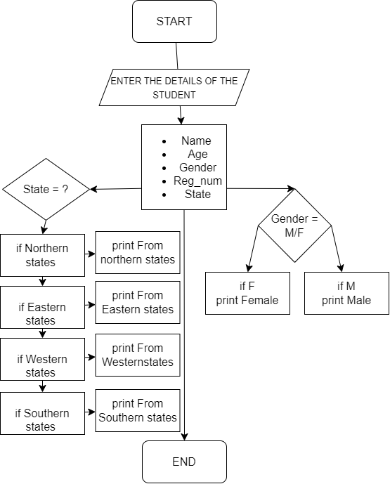

## Question

Write a Java Program that will collect your basic details that fall into different data types and displays them.
After the details have been displayed, with the help of conditional statements, check if the gender of the user is 'm' or 'f'. It should print "MALE" for 'm' and "FEMALE" for 'f'.

Assume that you can divide the states among India into four different regions (North, South, East, and West). If you are from the southern part of India; with the help of a switch statement, it should display The Student is from the southern states of India", along with the basic details.

### Student Information Program

This program allows you to input your personal information and displays it on the screen.

Input:
    The program prompts you to enter the following information:
    - Name
    - Age
    - Gender(m/M/F/f)
    - Register number
    - State

The program displays the input information and displays the details as follows:
    Name
    Age
    Gender(Male/Female)
    Register Number
    State
    Region(southern,northern,eastern,western)

 ## Flow chart:

 