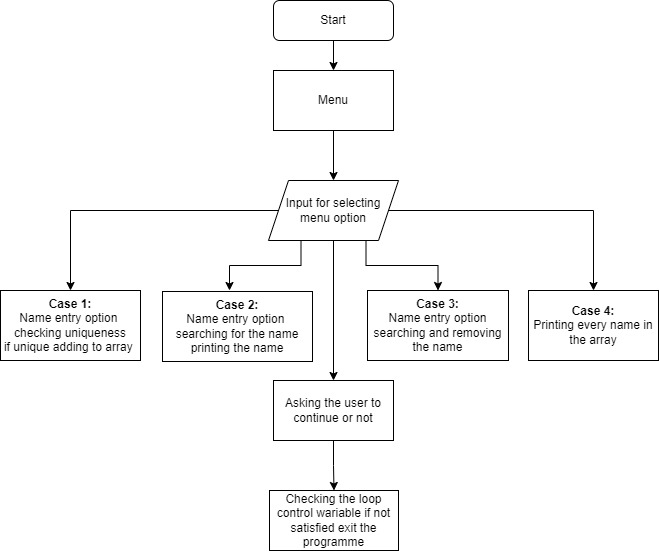

## Question 

You are supposed to create a menu-driven program that has the following menu options:
Enter a name
Search for a name
Remove a name
Show all names

Note:
The menu-driven program has to be made with the help of a do-while loop and switch-case statements.

Constraints:
The names collected must be stored in an array with a max length of 1024.
The names in the array should be UNIQUE; no duplicate entries are expected!
Provide necessary validations that the user enters only valid names that are not going to be repeated.
Removing a name should not create empty space inside the array!
Format your results properly!!

This is a simple Java menu driven program that allows you to manage a list of names.

The programme includes following features :

    1) Enter a name
        It will iterate through the array and check if the name already exists or not. If not it will add the name to the array.

    2) Search for a name
        It will check if the name exists by iteration. if yes it will print the name. if not it will print

    3) Remove a name
        It will iterate through the names, find the name and replace index of the name with the index of the next name and there by remove it from the array.
    4) Show all names
        It will iterate through the array and print all the names.

Constraints

This program can only store up to 1024 names.

Flow Chart:

