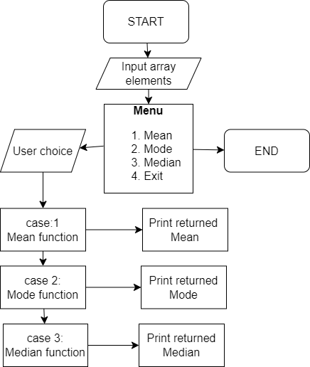

## Question

Create a java program that performs the following operation:
The program should collect an integer array from the user
After the array is entered, you need to create a menu of items
Find the Mean Value
Find the Median Value
Find the Mode Value
From the user-given array.
The program should have a minimum of 3 functions apart from the main function; each of the functions implements the Mean, Median, and Mode computation by accepting the array user has entered as a parameter and returning the value as a result. From the main method, you will display the result.

This Java program calculates the Mean, Median, and Mode of an Array of 10 integers. It takes the input from the user and then displays a menu to select the operation to perform.

## How to use the program?

Run the program in a Java compiler or IDE.
Enter the 10 integers when prompted by the program.
Select the operation to perform: Mean, Median, or Mode.
If you want to perform another operation, enter 0 to continue, else enter any other number to exit the program.

## The program has the following functions:

mean(int[] arr): Calculates the mean (average) of the given integer array.
median(int[] arr): Calculates the median of the given integer array.
mode(int[] arr): Calculates the mode (most frequent element) of the given integer array.

## How does it work?

The main() function takes input from the user and creates an integer array of size 10.
The user selects an operation to perform from the menu.
Depending on the selection, the corresponding function is called to calculate the required value.
The calculated value is displayed on the console.
The user is prompted to continue or exit the program.

## Assumptions:

The program assumes that the user will only enter 10 integers and will not enter any non-integer values.
 
 ## Flow chart:

 