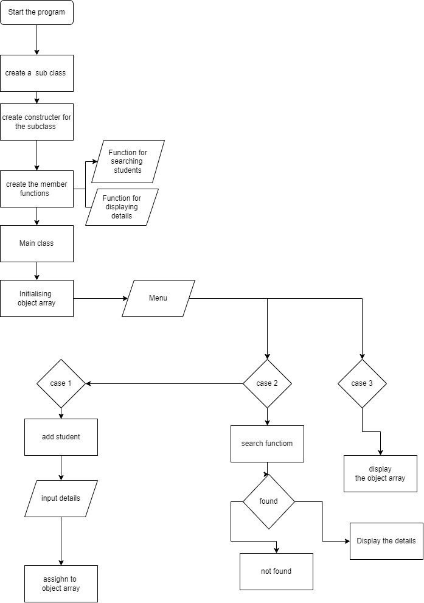

# Student Register
Student Register System
This program allows the user to create a student register system. The user can add new students to the register, search for existing students by name or registration number, and display the details of all students in the register. The program uses a class called stud to represent each student in the register.

## Usage
Run the program.
Choose an option from the menu:
Enter 1 to add a student
Enter 2 search a student
Enter 3 to display all the details of all students
Enter any other key to exit
Follow the prompts to add or search for a student.
The program will continue to run until the user enters a key other than 0.
## Class Structure
The stud class has the following attributes:

Reg_No (String)
Name (String)
Email (String)
Phone (String)
Class (String)
Department (String)
It also has the following methods:

display(): Prints the details of the student to the console.
search(String par, int m): Searches for the student based on the search parameter (par) and the search type (m). Returns true if the student is found, and false otherwise.
The studentregister class is the main class that runs the program. It creates an array of stud objects to store the students in the register. It has the following methods:

main(String[] args): The main method that runs the program. It displays a menu of options, and allows the user to add, search, and display students in the register.

## Flow Chart
 

