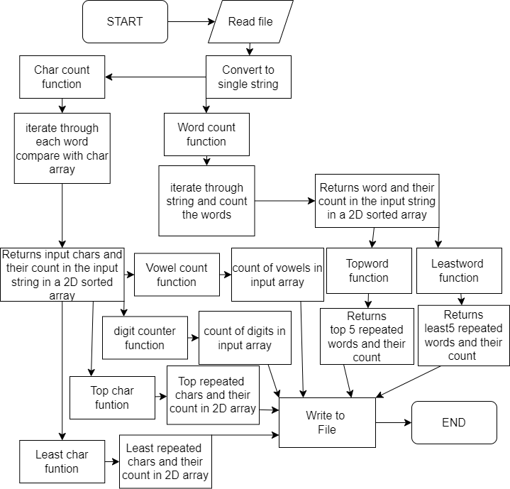

Write a JAVA program that reads a file (text file) and finds the following details.
1.	Vowels and their count. Eg: [a:100, e:45, I:55, ..]
2.	Digits and their count. Eg: [0:1000, 1:10, 2:40, ...]
3.	Top Five repeated words and their count.
4.	Least Five repeated words and their count.
5.	Top Five repeated characters and their count.
6.	Least FIve repeated characters and their count.
Note:
•	Use the file attached.
•	Use functions to implement the six functions asked.
•	Pass the file content to the functions and return the values accordingly.
•	No Global variables are allowed to be used.
## flowchart
