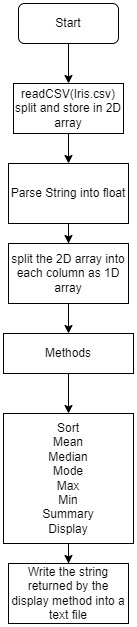

# Iris Data Analysis Program
This is a Java program that analyzes the famous Iris flower dataset. The program reads a CSV file containing the data and performs some basic statistical analysis on it. The analysis includes calculating the mean, median, mode, range, variance, and standard deviation of each feature for each of the three species of Iris flowers in the dataset.
## USAGE
You will also need to have a CSV file containing the Iris dataset. The program expects the CSV file to have the following columns: "Id", "SepalLengthCm", "SepalWidthCm", "PetalLengthCm", "PetalWidthCm", and "Species".

## Running the Program
To run the program, navigate to the directory containing the Java source code.

## OUTPUT:
The program will output the results of the analysis to the console and also write a summary table to a text file named "Output.txt" in the same directory as the CSV file.

## FLOW CHART

